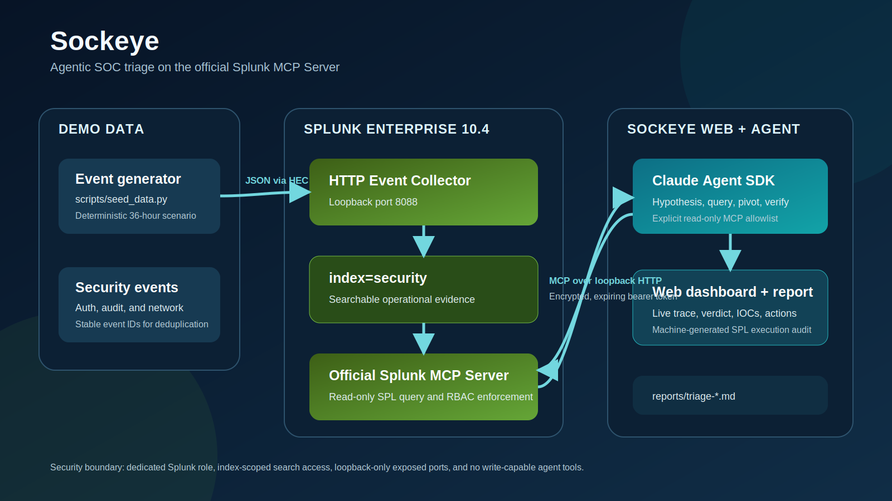

# Sockeye - Agentic SOC Triage on the Splunk MCP Server

**Splunk Agentic Ops Hackathon 2026**<br>
**Track:** Security | **Prize category:** Best Use of Splunk MCP Server

Sockeye is an autonomous SOC-triage agent. It connects Claude to a live Splunk
Enterprise instance through the official [Splunk MCP Server][mcp-app], searches
operational data with SPL, follows suspicious evidence across authentication,
audit, and network events, and produces a ranked incident report with a
machine-generated ledger of every query it actually ran.

It is an investigator, not an alert summarizer. The model chooses its pivots,
but Splunk remains the source of truth and the runner records the exact MCP tool
inputs behind the final report.



## Why it matters

Tier-1 SOC triage is high-volume, repetitive work: establish whether an alert is
real, determine whether access succeeded, scope follow-on activity, and hand an
analyst a defensible containment plan. Sockeye automates that sequence while
keeping the evidence inspectable.

The included demo buries a five-stage intrusion in 1,976 events spanning 36
hours. Sockeye must independently separate benign noise and an unsuccessful
password spray from a successful service-account compromise, privilege
escalation, lateral movement, collection, and outbound data transfer.

## Security model

- The agent receives an encrypted, expiring token for a dedicated Splunk user.
- Its Splunk role has only `search` and `mcp_tool_execute`, with allowed/default
  indexes and an enforced search filter restricted to `index=security`.
- The Claude SDK is restricted to the read-only `splunk_run_query` MCP tool;
  local file, shell, web, and write tools are not exposed to the agent.
- Docker publishes Splunk Web, HEC, and the management/MCP port on loopback only.
- The local demo uses HTTP for MCP on loopback to avoid globally disabling TLS
  verification for the Claude subprocess. Remote MCP URLs must use HTTPS.
- Log content is treated as untrusted input and cannot override agent policy.

This is a triage assistant, not an autonomous response system. A human should
review findings before taking containment action.

## Quick start

Prerequisites: Docker with Compose, Python 3.10+, a [Splunk account][splunk], and
either Claude Code logged into a Pro/Max account or an `ANTHROPIC_API_KEY`.

```bash
git clone https://github.com/dmetagame/sockeye
cd sockeye

# Python environment
python3 -m venv .venv
.venv/bin/pip install -r requirements.lock

# Local secrets: replace the two example values
cp .env.example .env

# Download Splunk MCP Server 1.2.0 from Splunkbase and place the package here:
# docker/apps/splunk-mcp-server_120.tgz

# Start pinned Splunk Enterprise 10.4 and configure the demo
docker compose -f docker/docker-compose.yml --env-file .env up -d
./scripts/setup_splunk.sh

# Seed or refresh the deterministic scenario, then investigate it
python3 scripts/seed_data.py
.venv/bin/python agent/triage.py
```

The report is written to `reports/triage-<UTC timestamp>.md`. Re-running the
seeder is supported: demo events have stable `event_id` values and the agent is
instructed to deduplicate them before counting.

Verify the MCP connection independently with:

```bash
python3 scripts/verify_mcp.py
```

## Web dashboard

Sockeye also ships as an authenticated web application with live investigation
progress, persisted history, safe report rendering, and markdown downloads.

```bash
# After completing the Splunk setup above, set ANTHROPIC_API_KEY and
# SOCKEYE_WEB_API_KEY in .env, then run:
docker compose \
  -f docker/docker-compose.yml \
  -f docker/docker-compose.web.yml \
  --env-file .env \
  up -d --build web
```

Open `http://127.0.0.1:3000`. The service runs one investigation at a time,
keeps Splunk on the private Compose network, and stores job history in a Docker
volume. See [docs/deployment.md](docs/deployment.md) for hosted deployment,
security boundaries, environment variables, and API endpoints.

## What the agent does

1. Sweeps the requested index and time range by sourcetype and event volume.
2. Measures authentication failures by source and account.
3. Pivots from suspicious attempts to successful access and later activity.
4. Correlates privilege escalation, lateral movement, collection, and transfer.
5. Produces a markdown verdict, timeline, IOCs, evidence, and ranked actions.
6. Appends an execution audit generated from the actual MCP tool calls.

The default scope is `index=security earliest=-48h latest=now`. It can be
changed without editing code:

```bash
.venv/bin/python agent/triage.py --index security --earliest -24h --model sonnet
```

## Demo scenario

| Phase | Activity | Sourcetype |
|---|---|---|
| Baseline | Normal staff logins and routine outbound traffic | `auth:demo`, `network:demo` |
| Password spray | Distributed low-and-slow failures across many accounts | `auth:demo` |
| Brute force | Focused failures against `svc-backup` | `auth:demo` |
| Initial access | Successful login from the brute-force source | `auth:demo` |
| Escalation and movement | `sudo su -` and a first-observed file-server login | `audit:demo`, `auth:demo` |
| Collection and transfer | Sensitive directories archived and large outbound flows | `audit:demo`, `network:demo` |

## Repository layout

```text
agent/triage.py          Agent runner, policy, validation, and query audit
architecture.svg         Root-level architecture diagram for the submission
docker/                   Pinned local Splunk environment
web/                      FastAPI service, durable job queue, and dashboard
scripts/setup_splunk.sh   Index, app, RBAC, user, and token configuration
scripts/seed_data.py      Deterministic synthetic incident generator
scripts/verify_mcp.py     Independent MCP protocol and tool check
tests/                    Unit tests for runner and data-generation behavior
docs/                     Devpost copy, video plan, and sample output
```

## Development

```bash
.venv/bin/python -m pytest
.venv/bin/ruff check .
bash -n scripts/setup_splunk.sh
docker compose -f docker/docker-compose.yml --env-file .env config -q
```

`requirements.txt` records direct dependencies; `requirements.lock` pins the
complete verified runtime environment. CI runs syntax checks, Ruff, tests,
dependency validation, and Compose config validation on every push and pull
request.

## Limitations

- The demo uses synthetic data and a deliberately compact schema.
- LLM analysis is nondeterministic; the runner validates report structure and
  records exact queries, but human review remains required.
- The setup script is intended for the included disposable local container, not
  an existing production Splunk deployment.
- The Splunk MCP Server package cannot be redistributed and must be downloaded
  from Splunkbase by each user.

## License

MIT. See [LICENSE](LICENSE).

[mcp-app]: https://splunkbase.splunk.com/app/7931
[splunk]: https://www.splunk.com/en_us/form/sign-up.html
