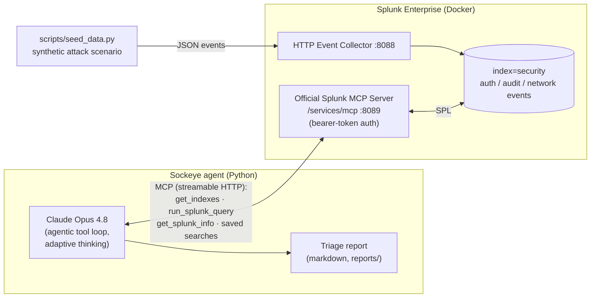

# Sockeye 🐟 — Agentic SOC Triage on the Splunk MCP Server

**Track:** Security · **Categories:** Best Use of MCP Server
**Splunk Agentic Ops Hackathon 2026**

Sockeye is an autonomous SOC-triage agent. It connects Claude to a live Splunk
Enterprise instance through the **official Splunk MCP Server** (Splunkbase app
[7931](https://splunkbase.splunk.com/app/7931)), sweeps the security index for
suspicious activity, pivots through the evidence with SPL like a human analyst
— spray → brute force → breach → escalation → exfil — and produces a ranked,
evidence-backed incident report in minutes instead of hours.

## Why it matters

Tier-1 triage is the highest-volume, most repetitive job in a SOC. Sockeye
doesn't just summarize alerts: it *investigates*. Every claim in its report is
backed by an SPL query it actually ran through the MCP server, so analysts can
audit the chain of evidence and jump straight to containment.

## Architecture



**Data flow:** the seeder ingests a realistic 36-hour attack scenario via HEC →
Claude calls the official Splunk MCP Server's tools (`run_splunk_query`,
`get_indexes`, …) over the Model Context Protocol → iteratively narrows from
"what's noisy" to "who got in, what did they take" → emits a markdown triage
report with verdict, timeline, IOCs, evidence, and ranked containment actions.

## Quick start

Prereqs: Docker, Python 3.10+, a [splunk.com account](https://www.splunk.com/en_us/form/sign-up.html),
an [Anthropic API key](https://console.anthropic.com/).

```bash
git clone https://github.com/dmetagame/sockeye && cd sockeye

# 1. Configure secrets
cp .env.example .env           # edit: SPLUNK_PASSWORD, SPLUNK_HEC_TOKEN, ANTHROPIC_API_KEY

# 2. Start Splunk Enterprise (free trial license)
docker compose -f docker/docker-compose.yml --env-file .env up -d

# 3. Download the official Splunk MCP Server app (.tgz) from
#    https://splunkbase.splunk.com/app/7931 and drop it into docker/apps/

# 4. Configure Splunk: index, token auth, MCP app install, bearer token
./scripts/setup_splunk.sh      # writes SPLUNK_MCP_TOKEN into .env

# 5. Seed the synthetic security incident
set -a; source .env; set +a
python3 scripts/seed_data.py

# 6. Run the agent
pip install -r requirements.txt
python3 agent/triage.py        # report lands in reports/
```

## The demo scenario

`scripts/seed_data.py` generates ~2,000 events across 36 hours in
`index=security`:

| Phase | What happens | Sourcetype |
|---|---|---|
| baseline | 14 staff accounts, normal office logins | `auth:demo` |
| 1 · spray | low-and-slow password spray from 185.220.101.0/24 | `auth:demo` |
| 2 · brute force | focused attack on `svc-backup` from 91.240.118.172 | `auth:demo` |
| 3 · breach | the attacker's login **succeeds** | `auth:demo` |
| 4 · escalation | `sudo su -`, lateral move to the file server | `audit:demo` |
| 5 · exfil | ~600 MB outbound to the attacker IP over 443 | `network:demo` |

Sockeye finds the trail on its own — the system prompt describes the *method*
(sweep, pivot, quantify, report), never the planted answer.

## Stack

- **Splunk Enterprise** (Docker, trial license) + **official Splunk MCP Server** (Splunkbase 7931)
- **Model Context Protocol** — streamable HTTP transport, bearer-token auth
- **Claude Opus 4.8** via the Anthropic Python SDK's MCP tool-runner helpers
- Python 3.10+, no framework — the agent is ~100 lines

## Repo layout

```
agent/triage.py        the agent: MCP client + Claude tool loop
scripts/setup_splunk.sh one-shot Splunk config (index, RBAC, app, token)
scripts/seed_data.py   synthetic attack-scenario generator (HEC)
docker/                docker-compose for Splunk Enterprise
reports/               agent output (gitignored)
```

## License

MIT — see [LICENSE](LICENSE).
